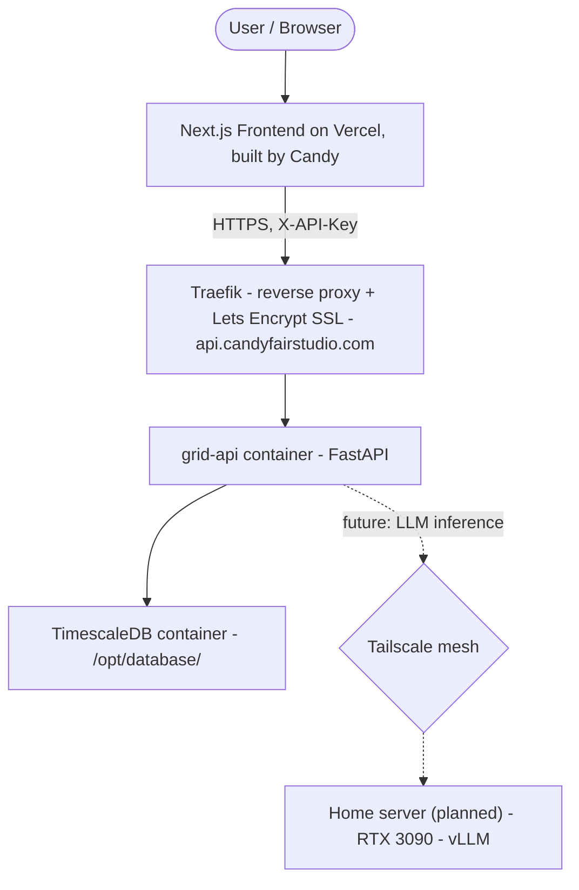
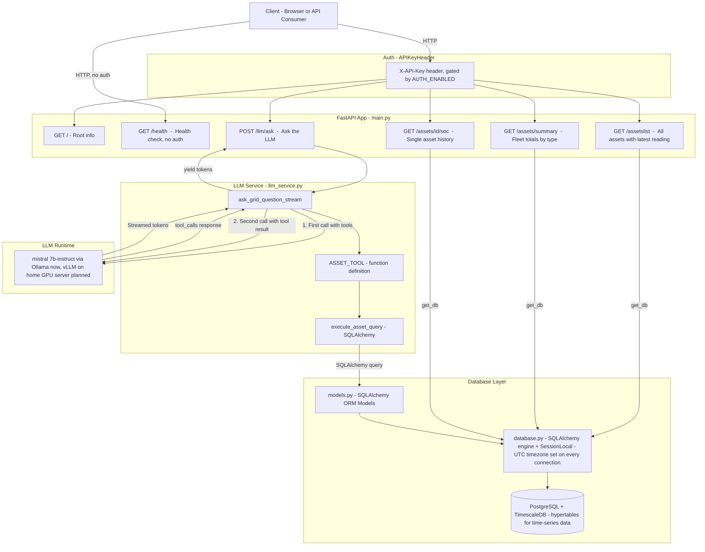
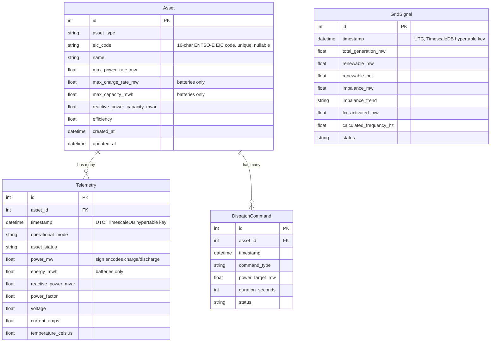

# RADA — Renewable Assets Data Analytics

*Grid-scale renewable energy asset monitoring and AI analytics platform*
*(previously developed under the working name "BESS Grid Manager")*

RADA is a grid-scale monitoring and analytics platform for renewable energy fleets — batteries (BESS), solar farms, and wind farms. It maintains a registry of assets identified by ENTSO-E EIC codes, ingests 10-minute telemetry into a PostgreSQL/TimescaleDB database, exposes a FastAPI REST API with adaptive time-series downsampling, and answers natural-language questions about the fleet via a locally-running LLM with live database access. 

This is built as the backend counterpart to the **[RADA frontend](https://github.com/candyfair/rada-frontend)** developed by [Candice Fairand](https://github.com/Candyfair).

Units throughout are **MW** (power), **MWh** (energy), and **MVAr** (reactive power), consistent with grid-scale industry standards.

---

## Table of Contents

1. [Project Overview](#1-project-overview)
2. [Architecture](#2-architecture)
3. [File Structure](#3-file-structure)
4. [Data Models](#4-data-models)
5. [API Endpoints](#5-api-endpoints)
6. [Authentication, Security & CORS](#6-authentication-security--cors)
7. [Environment Configuration](#7-environment-configuration)
8. [Local Development Setup](#8-local-development-setup)
9. [Production Deployment](#9-production-deployment)
10. [Seeding & the Telemetry Simulator](#10-seeding--the-telemetry-simulator)
11. [LLM Integration — Current State & Roadmap](#11-llm-integration--current-state--roadmap)
12. [Frontend](#12-frontend)
13. [Key Architectural Decisions & Learnings](#13-key-architectural-decisions--learnings)
14. [Roadmap — On the Horizon](#14-roadmap--on-the-horizon)

---

## 1. Project Overview

RADA provides:

- A **PostgreSQL database with the TimescaleDB extension**, holding grid-scale asset data — batteries, solar farms, and wind farms — with telemetry stored as time-series hypertables
- **30 days of seeded historical telemetry** at 10-minute resolution, plus a **live telemetry simulator** that continues posting realistic readings every 10 minutes through the same API real assets would use
- A **FastAPI REST backend** for querying asset reference data, current status, and historical telemetry, with **adaptive downsampling** for charting (raw 10-minute data for short ranges, `time_bucket()` aggregation for longer ones, capped at 250 points per response)
- **API key authentication** (toggleable per environment) and CORS configured for the Next.js frontend
- An **LLM integration** (currently Mistral via Ollama) that answers natural-language questions about the fleet by calling SQLAlchemy queries as tools — narrating live data rather than guessing from training
- A **production deployment** on a Hetzner VPS behind Traefik with automatic Let's Encrypt SSL, with a Next.js frontend on Vercel

> **Note on naming:** the product is now branded **RADA**. The underlying repos, containers, and directories (`grid-deploy`, `grid-api`, `grid_assets.db` references, etc.) retain their original working names — this is normal and doesn't need to change for the rename to apply at the product level.

---

## 2. Architecture

### Production deployment topology



The VPS runs Docker Compose (project name `www`, network `www_cb_network`) at `/var/www/docker-compose.yml`. TimescaleDB runs as a **separate container** at `/opt/database/`, decoupled from the API container's lifecycle.

### Application-level architecture



### LLM tool-calling flow

The `/llm/ask` endpoint uses a **two-pass pattern** in `llm_service.py`:

1. The model receives the user's question along with a tool definition (`get_all_assets`). It decides whether a database lookup is needed.
2. If it calls the tool, the service executes the corresponding SQLAlchemy query and sends the result back to the model.
3. The model generates a final answer, streamed token-by-token back to the client via `StreamingResponse`.

This means the LLM **narrates results from live data rather than guessing from training** — see [§13](#13-key-architectural-decisions--learnings) for why this matters.

---

## 3. File Structure

```
grid-deploy/
│
├── main.py              # FastAPI app — routes, CORS, dependency injection
├── database.py          # PostgreSQL/TimescaleDB engine, SessionLocal, Base, get_db()
│                         #   — sets UTC timezone on every connection
├── models.py             # All SQLAlchemy ORM models
├── auth.py               # APIKeyHeader dependency, AUTH_ENABLED toggle
├── llm_service.py        # Mistral/vLLM tool-calling and streaming logic
├── simulator.py          # Telemetry simulator (SIMULATOR_INTERVAL_SEC)
├── seed_batteries.py      # Seeds 30 days of historical data (run inside container)
├── seed_solar.py
├── seed_wind.py
├── .env                  # Local environment config (AUTH_ENABLED=false)
├── .env.production        # VPS environment config (AUTH_ENABLED=true)
├── Dockerfile
├── requirements.txt
└── venv/                  # Virtual environment (not committed to git)
```

> ⚠️ **Check against current code:** the database/auth/simulator layer has changed significantly since this README was first written (SQLite → PostgreSQL/TimescaleDB, plus auth and CORS additions). The filenames above reflect the architecture described in our working notes — confirm exact filenames against the current `grid-deploy` repo and adjust if they've diverged.

---

## 4. Data Models

Asset reference data and time-series telemetry are split as before, but time-series tables now live in **TimescaleDB hypertables** for efficient range queries and downsampling.

### Entity Relationship Diagram



### Enums

**AssetType**

| Value | Description |
|---|---|
| `battery` | Battery energy storage system (BESS) |
| `solar` | Solar photovoltaic farm |
| `wind` | Wind farm |

**GridConnectionStatus** (`Telemetry.operational_mode`)

| Value | Description |
|---|---|
| `active` | Operating normally — charge/discharge direction read from sign of `power_mw` |
| `curtailed` | Output restricted by grid operator instruction |
| `holding` | Standing by, reserved for frequency response |
| `fault` | Asset is in a fault state |

**AssetStatus** (`Telemetry.asset_status`)

| Value | Description |
|---|---|
| `communicating` | Asset is reachable and reporting data |
| `unreachable` | Asset is not responding |

### Key design decisions

- **Asset = metering point = dispatch unit.** A solar or wind farm is modelled as a single asset at one grid connection point — aligned with how RTE/ENTSO-E metering works.
- **`eic_code` is the canonical identifier**, supporting both GB (Elexon BMU) and French/European (RTE) market contexts. Exactly 16 characters, unique, nullable for unregistered assets.
- **`power_mw` sign convention.** Positive = exporting to the grid (discharging/generating); negative = importing (charging). Direction is not stored as a separate column.
- **Timestamps are always UTC.** `database.py` sets `SET TIME ZONE 'UTC'` on every connection via a SQLAlchemy connect event. The frontend converts to `Europe/Paris` for display.
- **Schema enrichment deferred.** Additional fields (`ambient_temperature_c`, `panel_temperature_c`, `irradiance_w_m2`, `cell_temperature_c`) are planned but deferred until the frontend has UI to render them.

---

## 5. API Endpoints

| Method | Endpoint | Auth required? | Description |
|---|---|---|---|
| `GET` | `/` | Yes (if `AUTH_ENABLED`) | API name and running status |
| `GET` | `/health` | **No, always open** | Health check, returns `healthy` |
| `GET` | `/assetslist` | Yes | All assets with their latest telemetry row joined |
| `GET` | `/assets/summary` | Yes | Fleet-wide totals, broken down by asset type |
| `GET` | `/assets/{asset_id}/soc` | Yes | Single asset — latest record (`mode=S`) or history (`mode=D`) |
| `POST` | `/llm/ask?question=...` | Yes | Streams an LLM answer using live DB tool calling |

> **Route ordering matters:** `/assets/summary` must be declared **before** `/assets/{asset_id}` in `main.py`, otherwise FastAPI matches `summary` as a path parameter and the summary endpoint becomes unreachable.

All authenticated requests must include:

```
X-API-Key: <API_KEY>
```

When `AUTH_ENABLED=false` (local development), this header is ignored.

---

### `GET /assetslist`

```bash
curl -H "X-API-Key: $API_KEY" "https://api.candyfairstudio.com/assetslist"
```

Returns all assets (batteries, solar, wind) with their latest telemetry row joined. No asset type filter is applied.

```json
[
  {
    "id": 1,
    "asset_type": "battery",
    "eic_code": "17W-0000-0000-0-A",
    "name": "Fluence Gridstack Alpha",
    "max_capacity_mwh": 120.0,
    "max_charge_rate_mw": 60.0,
    "max_power_rate_mw": 60.0,
    "reactive_power_capacity_mvar": 12.0,
    "efficiency": 0.92,
    "timestamp": "2026-04-30T14:30:00Z",
    "operational_mode": "active",
    "asset_status": "communicating",
    "energy_mwh": 87.4,
    "power_mw": -45.2,
    "reactive_power_mvar": 3.1,
    "power_factor": 0.998
  }
]
```

---

### `GET /assets/summary`

```bash
curl -H "X-API-Key: $API_KEY" "https://api.candyfairstudio.com/assets/summary"
```

Returns fleet-wide aggregated totals from the latest telemetry row for each asset, broken down by asset type.

```json
{
  "total_power_mw": -312.5,
  "total_energy_mwh": 2840.1,
  "total_reactive_mvar": 28.4,
  "by_asset_type": {
    "all":     { "power_mw": -312.5, "energy_mwh": 2840.1, "asset_count": 48 },
    "battery": { "power_mw": -210.0, "energy_mwh": 1950.0, "asset_count": 30 },
    "solar":   { "power_mw":  -68.5, "energy_mwh":   540.6, "asset_count": 9 },
    "wind":    { "power_mw":  -34.0, "energy_mwh":   349.5, "asset_count": 9 }
  }
}
```

---

### `GET /assets/{asset_id}/soc`

| Parameter | Required | Description |
|---|---|---|
| `mode` | Yes | `S` — latest record only; `D` — historical records |
| `from_ts` | No | ISO datetime lower bound (D mode only) |
| `to_ts` | No | ISO datetime upper bound (D mode only) |
| `limit` | No | Max points returned in D mode — default `288` (24 hrs at 10-min intervals), **capped at 250 for chart ranges** |

**`mode=S` — latest record:**

```bash
curl -H "X-API-Key: $API_KEY" "https://api.candyfairstudio.com/assets/1/soc?mode=S"
```

**`mode=D` — history with adaptive downsampling:**

```bash
curl -H "X-API-Key: $API_KEY" \
  "https://api.candyfairstudio.com/assets/1/soc?mode=D&from_ts=2026-04-29T00:00:00&to_ts=2026-05-29T23:59:59"
```

Downsampling rule:

- Ranges **≤ 2 days** return raw 10-minute records.
- Longer ranges use TimescaleDB's `time_bucket()`, with bucket size calculated as:

```python
bucket_minutes = ceil((delta_days * 24 * 60) / limit)
```

This keeps chart responses fast and bounded (max 250 points) while allowing drill-down to raw readings for short windows.

Returns `404` if the asset does not exist or has no records. Returns `400` if `mode` is not `S` or `D`, or if a timestamp parameter is not valid ISO format.

---

### `POST /llm/ask?question=...`

```bash
curl -X POST -H "X-API-Key: $API_KEY" \
  "https://api.candyfairstudio.com/llm/ask?question=Which+assets+are+currently+curtailed"
```

Streams a plain-text response token by token via `StreamingResponse`.

---

## 6. Authentication, Security & CORS

- **API key auth** via `APIKeyHeader` (`X-API-Key`). Gated by the `AUTH_ENABLED` environment variable:
  - `false` locally (`.env`) — no key required during development
  - `true` on the VPS (`.env.production`) — all routes except `/health` require a valid key
- **`/health` is always open**, regardless of `AUTH_ENABLED` — used for container health checks and uptime monitoring.
- **Swagger docs (`/docs`)** are disabled in production via the `ENVIRONMENT` variable, to avoid exposing the schema and a live "try it out" console publicly.
- **CORS** is configured via `CORSMiddleware` in `main.py` (added after app instantiation). Locally, `allow_origins` includes `http://localhost:3000`. For production, `allow_origins` must include the frontend's Vercel domain — this needs to be kept in sync whenever the frontend deployment URL changes.
- All internal calls (e.g. the telemetry simulator posting to the API) authenticate the same way as external clients, using `HEADERS = {"X-API-Key": API_KEY}`.

---

## 7. Environment Configuration

Two environment files, loaded via `python-dotenv`:

| File | Used by | Purpose |
|---|---|---|
| `.env` | Local development (T490) | `AUTH_ENABLED=false`, local DB connection string, `ENVIRONMENT=development` |
| `.env.production` | VPS (`/var/www/`) | `AUTH_ENABLED=true`, production DB connection string, `ENVIRONMENT=production`, `SIMULATOR_INTERVAL_SEC`, `API_KEY` |

Key variables:

| Variable | Purpose |
|---|---|
| `DATABASE_URL` | PostgreSQL/TimescaleDB connection string |
| `API_KEY` | Shared secret for `X-API-Key` header |
| `AUTH_ENABLED` | Toggles auth enforcement |
| `ENVIRONMENT` | `development` / `production` — controls Swagger docs visibility |
| `SIMULATOR_INTERVAL_SEC` | Interval (seconds) between simulated telemetry posts |
| RTE OAuth2 credentials | Stored server-side for Actual Generation / Balancing Energy API calls |

`.gitignore` excludes both `.env` files and any credentials.

---

## 8. Local Development Setup

### Activate the virtual environment

**Linux (T490, Kali Linux):**
```bash
source venv/bin/activate
```

### Install or update dependencies

```bash
pip install -r requirements.txt
```

| Package | Purpose |
|---|---|
| `fastapi` | Web framework and REST API |
| `uvicorn` | ASGI server |
| `sqlalchemy` | ORM — models and DB sessions |
| `psycopg2` / `asyncpg` | PostgreSQL driver |
| `ollama` | Python client for local LLM (`ollama.chat`) |
| `python-dotenv` | Load environment variables from `.env` |

### Run the API locally

```bash
uvicorn main:app --reload
```

With `AUTH_ENABLED=false`, all endpoints can be called without a key. Swagger docs are available at:

```
http://127.0.0.1:8000/docs
```

---

## 9. Production Deployment

The VPS (Hetzner CAX11, **ARM64**, Ubuntu) runs Docker Compose at `/var/www/docker-compose.yml` (project name `www`, network `www_cb_network`). TimescaleDB runs in its **own container** at `/opt/database/`, separate from the API container.

### Standard deploy sequence

```bash
cd ~/grid-deploy && git pull && \
  docker build --no-cache -t grid-api:latest . && \
  sudo docker compose -f /var/www/docker-compose.yml up -d grid-api
```

To stop the API container:

```bash
sudo docker compose -f /var/www/docker-compose.yml stop grid-api
```

> **ARM64 vs amd64:** the VPS is ARM64. Docker images must be **built natively on the VPS** — images built on the T490 (amd64) cannot be transferred. `docker build --no-cache` is the established pattern to avoid stale layer caching on rebuild.

### Seeding in production

Seed scripts run **inside** the running container:

```bash
docker exec grid_api python seed_batteries.py
```

### Traefik & SSL

Traefik handles all HTTPS termination and Let's Encrypt certificates for `api.candyfairstudio.com` automatically — certificates are never managed manually.

### Tailscale / DNS note

Tailscale can take over `/etc/resolv.conf` on the VPS, breaking Docker's DNS resolution for public domains (e.g. pulling base images, reaching `pypi.org`). Fix: set Docker's `daemon.json` to use `8.8.8.8` as a DNS server.

---

## 10. Seeding & the Telemetry Simulator

### Seeding

The seed scripts populate **30 days of realistic historical data at 10-minute resolution** across the fleet:

| Profile | Behaviour |
|---|---|
| **Battery** | State of charge starts at 60–85% of capacity and respects a 15% discharge floor — realistic for protecting battery chemistry |
| **Solar** | Generation follows a daylight bell curve; storage fields are `None` (not applicable) |
| **Wind** | Sinusoidal pattern with random variation |
| **Grid signals** | Frequency, voltage, demand, and renewable percentage, recorded every 5 minutes |

### Telemetry simulator

After seeding, the simulator keeps the dataset "live":

- Runs on a configurable interval (`SIMULATOR_INTERVAL_SEC`)
- Posts new readings for every asset via **authenticated internal HTTP calls** to the same API real assets would use:

```python
HEADERS = {"X-API-Key": API_KEY}
```

This means the frontend and LLM always see data arriving through the real ingestion path — there is no separate "simulation" code path in the API itself.

---

## 11. LLM Integration — Current State & Roadmap

### Current: Ollama + Mistral (local)

```bash
# One-time install
curl -fsSL https://ollama.com/install.sh | sh

# Pull the correct model
ollama pull mistral:7b-instruct
```

> **Important:** use `mistral:7b-instruct`, not `mistral:7b-instruct-q8_0`. The quantised `q8_0` variant does not support tool calling and returns HTTP 400 on `/llm/ask`.

Start Ollama in a separate terminal before FastAPI:

```bash
ollama serve   # http://localhost:11434
```

**Performance (CPU-only, T490):** ~60–75s time-to-first-token cold, ~20–30s warm.

### Planned: vLLM on a dedicated home GPU server

- An RTX 3090 (24GB VRAM) home server has been chosen to run inference, with **vLLM** selected over Ollama for its OpenAI-compatible API and significantly better time-to-first-token on a 24GB GPU.
- Integration is designed to be a small change: point the `openai` SDK at vLLM's `base_url` in `llm_service.py`, rather than rewriting the tool-calling logic.
- **Network routing:** the home server joins the existing Tailscale mesh; Traefik on the VPS proxies inference requests through the tunnel to vLLM. This keeps GPU workloads entirely off the VPS's 4GB RAM.
- This component is **not yet active in production** — pending home server setup.

---

## 12. Frontend

The frontend is developed by [@Candyfair](https://github.com/Candyfair) (Candy) as a separate Next.js application, hosted on Vercel:

**[Candyfair/grid-asset-manager-frontend](https://github.com/Candyfair/grid-asset-manager-frontend)**

Frontend responsibilities include:

- Fleet-wide **bubble chart** on login — bubble size reflects current charge/discharge relative to the fleet, bubble colour indicates telemetry health, with a fleet total for the selected asset type
- Filtering by asset type
- Asset detail view — current metrics, plus charting any metric over a user-defined time window, with multi-asset comparison
- Light and dark mode
- Converting UTC timestamps from the API to `Europe/Paris` for display

Frontend documentation is maintained separately by Candy, with cross-references back to this backend README where relevant.

---

## 13. Key Architectural Decisions & Learnings

- **LLMs narrate, Python computes.** A 3,836 kWh discrepancy was observed when Mistral performed arithmetic directly on production data. All numerical computation happens in dedicated SQLAlchemy/Python functions; the LLM selects and narrates results only.
- **Asset = metering point = dispatch unit.** A solar or wind farm is one asset at one grid connection point — standard practice aligned with RTE/ENTSO-E metering.
- **EIC codes as canonical identifiers**, supporting both GB (Elexon BMU) and French/European (RTE) contexts.
- **Adaptive downsampling.** Ranges ≤ 2 days return raw 10-minute records; longer ranges use `time_bucket()` with `bucket_minutes = ceil((delta_days * 24 * 60) / limit)`.
- **Charge/discharge direction is encoded in the sign of `power_mw`**, not a separate enum.
- **ARM64 vs amd64.** The VPS is ARM64 — Docker images must be built natively on it.
- **Tailscale/DNS conflict.** Tailscale can hijack `/etc/resolv.conf`; fix via `daemon.json` with `8.8.8.8`.
- **FastAPI route ordering.** More specific routes (`/assets/summary`) must be declared before parameterised routes (`/assets/{asset_id}`).
- **vLLM over Ollama** for production inference, once GPU hardware is available — OpenAI-compatible API and much lower time-to-first-token on 24GB VRAM.

---

## 14. Roadmap — On the Horizon

- [ ] **vLLM inference on the home server** — RTX 3090, integrated via the `openai` SDK pointed at vLLM's `base_url`
- [ ] **Tailscale routing for LLM traffic** — Traefik on the VPS proxying through the tailnet to vLLM on the home server
- [ ] **GitHub Actions CI/CD** — automatic deploy on push (not yet implemented)
- [ ] **Architecture & installation documentation** — DB and backend as separate containers; frontend docs handled separately by Candy
- [ ] **Schema enrichment** — `ambient_temperature_c`, `panel_temperature_c`, `irradiance_w_m2`, `cell_temperature_c`, deferred until the frontend can render them
- [ ] **Headscale** — self-hosted Tailscale coordination server, deployable on the existing VPS once the stack is stable

---

*RADA · FastAPI · SQLAlchemy · PostgreSQL + TimescaleDB · Mistral/Ollama (-> vLLM) · Docker · Traefik · Next.js · Python*
