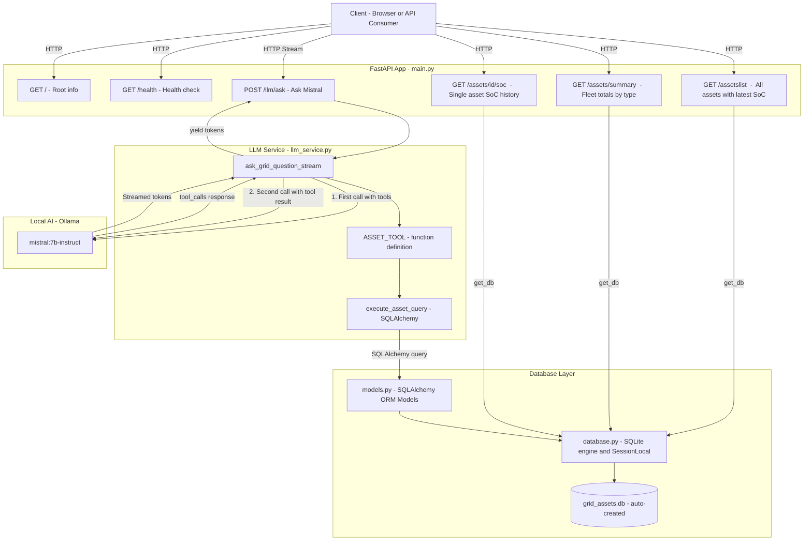
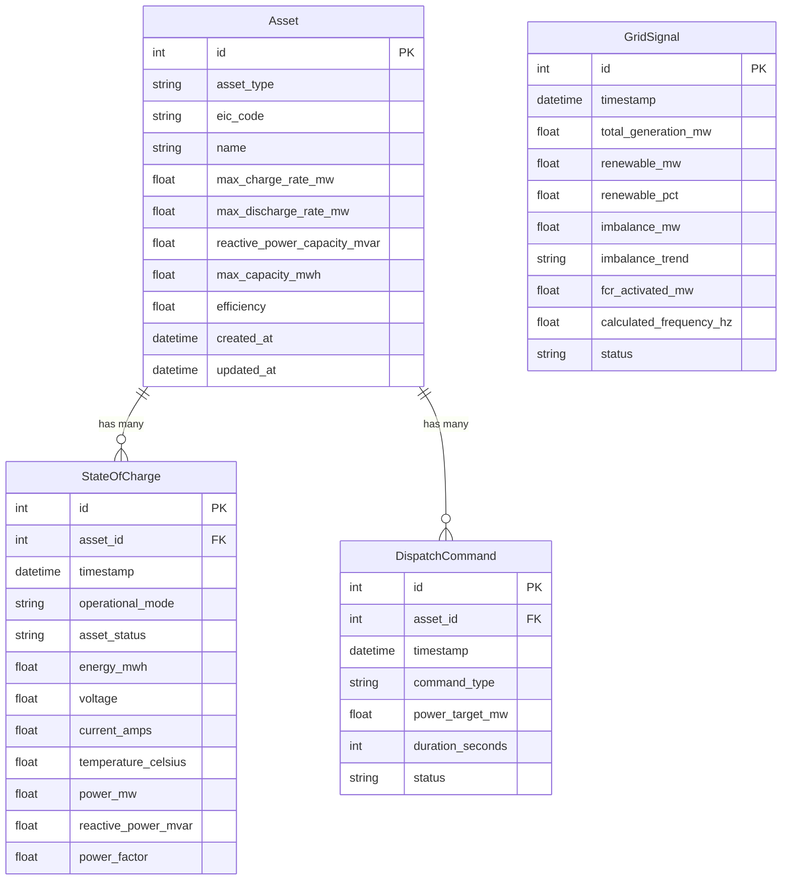
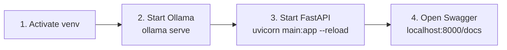

# BESS Grid Manager

A grid-scale renewable energy asset monitoring and AI analysis platform built with FastAPI, SQLAlchemy, and Mistral via Ollama. The application exposes a REST API for querying a fleet of batteries, solar farms, and wind turbines, and accepts natural language questions answered by a locally-running LLM with live access to the database.

---

## Table of Contents

1. [Project Overview](#1-project-overview)
2. [Architecture](#2-architecture)
3. [File Structure](#3-file-structure)
4. [Data Models](#4-data-models)
5. [API Endpoints](#5-api-endpoints)
6. [Setting Up the Virtual Environment](#6-setting-up-the-virtual-environment)
7. [Connecting to Ollama and Mistral](#7-connecting-to-ollama-and-mistral)
8. [Running the Application](#8-running-the-application)
9. [Seeding the Database](#9-seeding-the-database)
10. [Daily Development Workflow](#10-daily-development-workflow)

---

## 1. Project Overview

The BESS Grid Manager provides:

- A **SQLite database** (`grid_assets.db`) holding grid-scale asset data — batteries, solar farms, and wind turbines — created automatically on startup
- **Time-series history** for State of Charge, telemetry, dispatch commands, and grid signals stored at 10-minute resolution over 30 days
- A **FastAPI REST backend** for querying asset status and live operational data
- A **Mistral LLM integration** via Ollama that answers natural language questions about the fleet by calling SQLAlchemy queries as tools

Units throughout are **MW** (power) and **MWh** (energy), consistent with grid-scale industry standards.

---

## 2. Architecture



### LLM tool-calling flow

The `/llm/ask` endpoint uses a **two-pass pattern** in `llm_service.py`:

1. Mistral receives the user's question along with a tool definition (`get_all_assets`). It decides whether a database lookup is needed.
2. If it calls the tool, the service executes the corresponding SQLAlchemy query and sends the result back to Mistral.
3. Mistral generates a final answer, which is **streamed token-by-token** back to the client via `StreamingResponse`.

This means Mistral narrates results from live data rather than guessing from training — important for accurate capacity and energy figures.

---

## 3. File Structure

```
bess-grid-management/
│
├── main.py              # FastAPI app — routes and dependency injection
├── database.py          # SQLite engine, SessionLocal, Base, get_db()
├── models.py            # All SQLAlchemy ORM models
├── llm_service.py       # Mistral tool-calling and streaming logic
├── seed_data.py         # Populates 30 days of historical data
├── grid_assets.db       # SQLite database file (auto-created on startup)
├── requirements.txt     # Python dependencies
└── venv/                # Virtual environment (not committed to git)
```

---

## 4. Data Models

There are four tables. `Asset` is the master record; `StateOfCharge` and `DispatchCommand` are the time-series child tables linked by foreign key. `GridSignal` is standalone — it captures grid-level conditions with no link to individual assets.

### Entity Relationship Diagram



### Enums

**AssetType** — the type of generation or storage asset:

| Value | Description |
|---|---|
| `battery` | Battery energy storage system (BESS) |
| `solar` | Solar photovoltaic farm |
| `wind` | Wind turbine or wind farm |

**GridConnectionStatus** — the operational mode recorded in `StateOfCharge.operational_mode`:

| Value | Description |
|---|---|
| `active` | Operating normally — charge or discharge direction read from `power_mw` sign |
| `curtailed` | Output restricted by grid operator instruction |
| `holding` | Standing by, reserved for frequency response |
| `fault` | Asset is in a fault state |

**AssetStatus** — the communications state recorded in `StateOfCharge.asset_status`:

| Value | Description |
|---|---|
| `communicating` | Asset is reachable and reporting data |
| `unreachable` | Asset is not responding |

### Key design decisions

- **No separate telemetry table.** Voltage, current, and temperature readings are columns on `StateOfCharge`, keeping all per-asset time-series data in one place. The current value for any field is always the most recent row by timestamp.
- **`GridSignal` is standalone.** It has no foreign key to `Asset` — it captures grid-level conditions (generation mix, imbalance, FCR activation) that apply to the whole network, not a single asset. The `calculated_frequency_hz` field is derived from imbalance data, not a real instrument measurement.
- **`eic_code` is ENTSO-E standard.** Exactly 16 characters, unique per asset. Nullable to support assets that have not yet been registered.
- **`power_mw` sign convention.** A positive value means the asset is importing (charging); a negative value means it is exporting (discharging). Direction is not stored as a separate column.

---

## 5. API Endpoints

| Method | Endpoint | Description |
|---|---|---|
| `GET` | `/` | Returns API name and running status |
| `GET` | `/health` | Health check — returns `healthy` |
| `GET` | `/assetslist` | All assets with latest `StateOfCharge` row joined |
| `GET` | `/assets/summary` | Fleet-wide power and energy totals, broken down by asset type |
| `GET` | `/assets/{asset_id}/soc` | Single asset SoC — latest record (`mode=S`) or history (`mode=D`) |
| `POST` | `/llm/ask?question=...` | Streams a Mistral answer using live DB tool calling |

---

### `GET /assetslist`

Returns all assets (batteries, solar, wind) with their latest `StateOfCharge` row joined. No asset type filter is applied.

```json
[
  {
    "id": 1,
    "asset_type": "battery",
    "eic_code": "17W-0000-0000-0-A",
    "name": "Fluence Gridstack Alpha",
    "max_capacity_mwh": 120.0,
    "max_charge_rate_mw": 60.0,
    "max_discharge_rate_mw": 60.0,
    "reactive_power_capacity_mvar": 12.0,
    "efficiency": 0.92,
    "soc_id": 4320,
    "operational_mode": "active",
    "asset_status": "communicating",
    "energy_mwh": 87.4,
    "power_mw": -45.2,
    "reactive_power_mvar": 3.1,
    "power_factor": 0.998,
    "last_updated": "2026-04-30T14:30:00"
  }
]
```

---

### `GET /assets/summary`

Returns fleet-wide aggregated totals from the latest `StateOfCharge` row for each asset, broken down by asset type.

```json
{
  "total_power_mw": -312.5,
  "total_energy_mwh": 2840.1,
  "total_reactive_mvar": 28.4,
  "by_asset_type": {
    "all":     { "power_mw": -312.5, "energy_mwh": 2840.1, "asset_count": 48 },
    "battery": { "power_mw": -210.0, "energy_mwh": 1950.0, "asset_count": 30 },
    "solar":   { "power_mw":  -68.5, "energy_mwh":   540.6, "asset_count": 9 },
    "wind":    { "power_mw":  -34.0, "energy_mwh":   349.5, "asset_count": 9 }
  }
}
```

---

### `GET /assets/{asset_id}/soc`

Returns state of charge data for a single asset. Behaviour is controlled by the `mode` query parameter.

| Parameter | Required | Description |
|---|---|---|
| `mode` | Yes | `S` — latest record only; `D` — historical records |
| `from_ts` | No | ISO datetime lower bound, e.g. `2026-04-25T00:00:00` (D mode only) |
| `to_ts` | No | ISO datetime upper bound, e.g. `2026-05-02T23:59:59` (D mode only) |
| `limit` | No | Max records returned in D mode — default `288` (24 hrs at 10-min intervals) |

**`mode=S` — latest record:**

```bash
GET /assets/1/soc?mode=S
```

```json
{
  "asset_id": 1,
  "asset_name": "Fluence Gridstack Alpha",
  "eic_code": "17W-0000-0000-0-A",
  "asset_type": "battery",
  "max_capacity_mwh": 120.0,
  "record": {
    "timestamp": "2026-04-30T14:30:00",
    "operational_mode": "active",
    "asset_status": "communicating",
    "energy_mwh": 87.4,
    "power_mw": -45.2,
    "reactive_power_mvar": 3.1,
    "power_factor": 0.998,
    "voltage": 415.2,
    "current_amps": -108.9,
    "temperature_celsius": 28.4
  }
}
```

**`mode=D` — history with optional date range:**

```bash
GET /assets/1/soc?mode=D&from_ts=2026-04-29T00:00:00&to_ts=2026-04-29T23:59:59
```

```json
{
  "asset_id": 1,
  "asset_name": "Fluence Gridstack Alpha",
  "eic_code": "17W-0000-0000-0-A",
  "asset_type": "battery",
  "max_capacity_mwh": 120.0,
  "record_count": 144,
  "from_ts": "2026-04-29T00:00:00",
  "to_ts": "2026-04-29T23:50:00",
  "records": [ { "..." : "..." } ]
}
```

Returns `404` if the asset does not exist or has no records. Returns `400` if `mode` is not `S` or `D`, or if a timestamp parameter is not valid ISO format.

---

### `POST /llm/ask?question=...`

```bash
curl -X POST "http://127.0.0.1:8000/llm/ask?question=Which+assets+are+currently+curtailed"
```

Streams a plain-text response token by token via `StreamingResponse`. Mistral receives the question, decides whether to call the `get_all_assets` tool, executes the live SQLAlchemy query if needed, then generates a grounded answer from real data.

---

## 6. Setting Up the Virtual Environment

The virtual environment is already created. Activate it before each development session.

### Activate

**Linux / macOS (ThinkPad T490):**
```bash
source venv/bin/activate
```

You will see `(venv)` at the start of your terminal prompt when active.

### Install or update dependencies

```bash
pip install -r requirements.txt
```

Core packages installed:

| Package | Purpose |
|---|---|
| `fastapi` | Web framework and REST API |
| `uvicorn` | ASGI server to run FastAPI |
| `sqlalchemy` | ORM — all models and DB sessions |
| `ollama` | Python client for Ollama (`ollama.chat`) |
| `python-dotenv` | Load environment variables from `.env` |

### Deactivate

```bash
deactivate
```

---

## 7. Connecting to Ollama and Mistral

### Install Ollama (one-time)

```bash
# Linux
curl -fsSL https://ollama.com/install.sh | sh
```

### Pull the correct model

```bash
ollama pull mistral:7b-instruct
```

> **Important:** Use `mistral:7b-instruct`, not `mistral:7b-instruct-q8_0`. The quantised `q8_0` variant does not support tool calling and will return HTTP 400 errors on the `/llm/ask` endpoint.

Confirm the model is available:

```bash
ollama list
# Should show: mistral:7b-instruct
```

### Start the Ollama server

Ollama must be running in a **separate terminal** before starting FastAPI:

```bash
ollama serve
```

Ollama runs at `http://localhost:11434` by default. `llm_service.py` connects here via `ollama.chat()`.

### Switching models

To use a different model, edit the model name in `llm_service.py`:

```python
model = "mistral:7b-instruct"   # Change this line
```

Then pull the new model with `ollama pull <model-name>` and restart FastAPI.

### Performance note

On CPU-only hardware, expect approximately 60–75 seconds time-to-first-token for a cold Mistral model, dropping to ~20–30 seconds when the model is warm (cached in memory). Once the RTX 3090 home server is online, inference time is expected to fall below 10 seconds.

---

## 8. Running the Application

### Prerequisites

- [ ] Virtual environment activated (`source venv/bin/activate`)
- [ ] Ollama running in a separate terminal (`ollama serve`)
- [ ] `mistral:7b-instruct` pulled (`ollama list`)

### Start the server

```bash
uvicorn main:app --reload
```

The `--reload` flag restarts the server automatically on code changes.

`grid_assets.db` is created automatically on first run if it does not exist. No manual database initialisation step is needed.

### Access the interactive API docs

```
http://127.0.0.1:8000/docs
```

The Swagger UI lets you test all endpoints directly in the browser without needing a separate client.

---

## 9. Seeding the Database

The seed script populates 30 days of realistic historical data at 10-minute resolution.

### What gets created

| Table | Records |
|---|---|
| `assets` | 48 total — 30 batteries, 9 solar farms, 9 wind turbines |
| `state_of_charge` | ~4,320 per asset (every 10 min × 30 days) |
| `asset_telemetry` | ~4,320 per asset |
| `dispatch_commands` | 1–3 per day per asset (~60 per asset) |
| `grid_signals` | ~8,640 (every 5 min × 30 days) |

### Run the seed

Delete any existing database first (schema changes require a clean rebuild):

```bash
rm grid_assets.db
python seed_data.py
```

### Data profiles

- **Battery SoC** starts at 60–85% of capacity and respects a 15% discharge floor — realistic for protecting battery chemistry
- **Solar** generation follows a daylight bell curve; `state_of_charge_percent` is `None` (not applicable)
- **Wind** follows a sinusoidal pattern with random variation
- **Grid signals** include frequency, voltage, demand, and renewable percentage

---

## 10. Daily Development Workflow



---

*BESS Grid Manager · FastAPI · SQLAlchemy · SQLite · Mistral · Ollama · Python*
