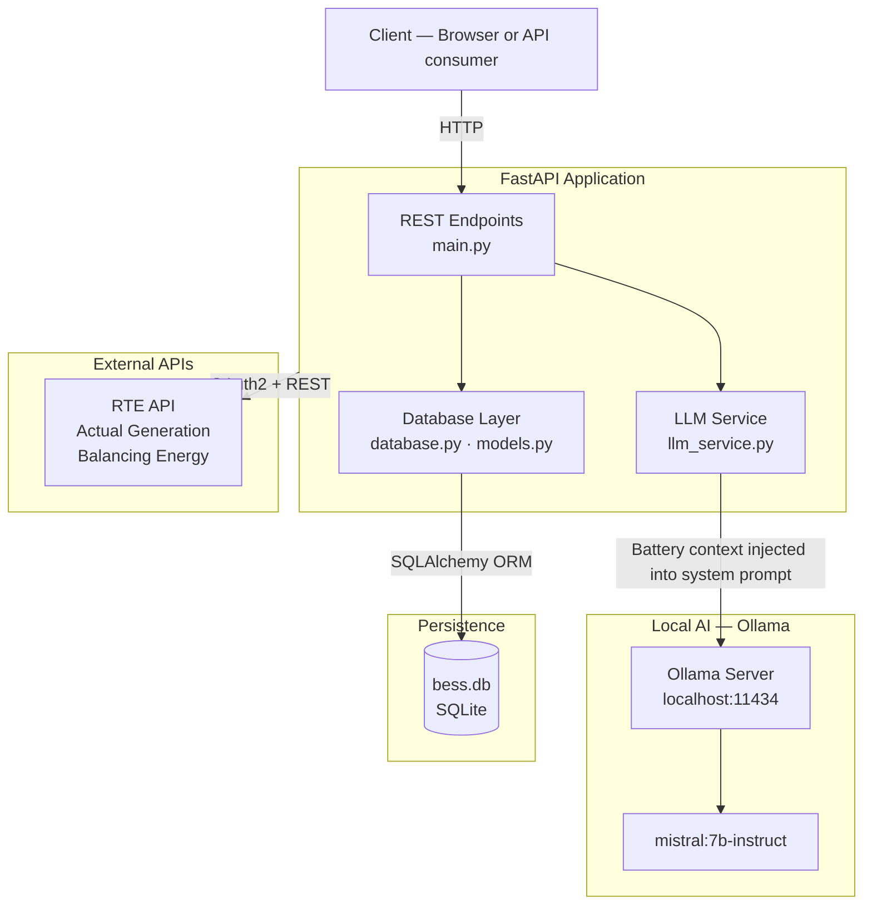
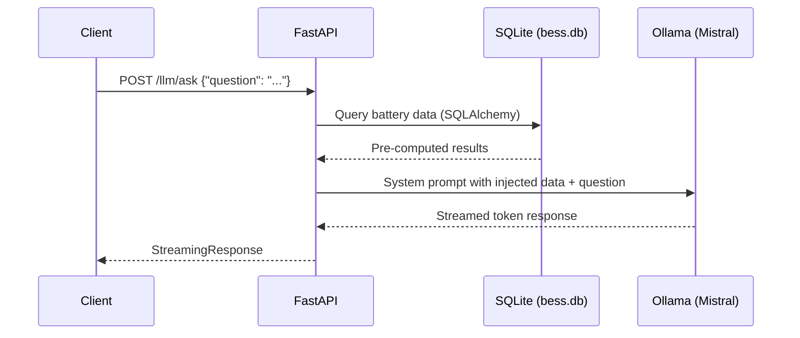
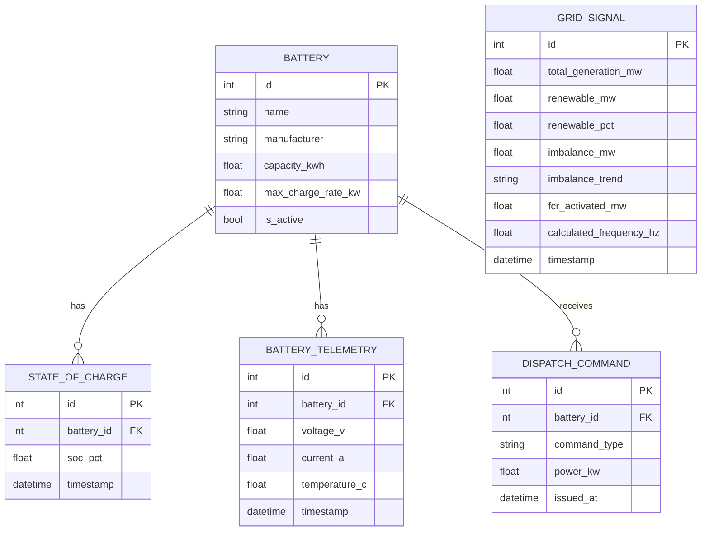
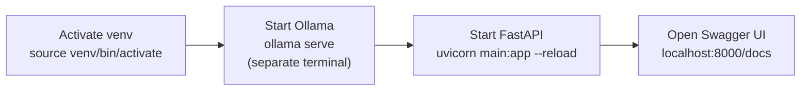

# BESS Grid Manager

A battery energy storage system monitoring and AI analysis platform built with FastAPI, SQLAlchemy, and Mistral via Ollama. The application exposes a REST API for querying BESS fleet data and accepts natural language questions about battery status, which are answered by a locally-running LLM with live access to the database.

---

## Table of Contents

1. [Project Overview](#project-overview)
2. [Architecture](#architecture)
3. [Data Models](#data-models)
4. [API Endpoints](#api-endpoints)
5. [Setting Up the Virtual Environment](#setting-up-the-virtual-environment)
6. [Connecting to Ollama and Mistral](#connecting-to-ollama-and-mistral)
7. [Running the Application](#running-the-application)
8. [Daily Development Workflow](#daily-development-workflow)
9. [Key Dependencies](#key-dependencies)

---

## Project Overview

BESS Grid Manager provides:

- A **REST API** for managing and querying battery asset data across a grid-scale fleet
- A **SQLite database** (`bess.db`) seeded with realistic data from real manufacturers (Tesla, Fluence, Sungrow, CATL, BYD, and others) across 31 batteries
- A **natural language query interface** powered by Mistral (via Ollama) using single-pass context injection — battery data is injected directly into the system prompt, and Mistral narrates the pre-computed results
- **RTE API integration** for live French grid signal data (Actual Generation and Balancing Energy endpoints)

---

## Architecture



### How the LLM integration works

The application uses **single-pass context injection** rather than tool calling. When a natural language question arrives:

1. Battery data is queried from the database using SQLAlchemy
2. The results are serialised and injected directly into the Mistral system prompt
3. Mistral receives the question alongside the pre-computed data and narrates the answer
4. The response streams back to the client

This approach is simpler, faster, and more reliable than two-pass tool calling — Mistral never performs arithmetic on production data, it only narrates results that have already been computed by Python.



---

## Data Models

Five SQLAlchemy ORM models backed by SQLite:



> `GridSignal` is a standalone table — it records grid-level data independent of individual batteries. The `calculated_frequency_hz` column name is intentional: it signals that this value is derived from grid measurements, not directly measured.

---

## API Endpoints

| Method | Endpoint | Description |
|---|---|---|
| `GET` | `/` | Returns API name and status |
| `GET` | `/health` | Health check |
| `GET` | `/batteries` | All battery records |
| `POST` | `/llm/ask` | Natural language question — returns a streamed Mistral answer |

Interactive API docs are available at `http://127.0.0.1:8000/docs` when the server is running.

---

## Setting Up the Virtual Environment

The virtual environment is already created in the project root (`venv/`). You do not need to recreate it.

### Activate the virtual environment

```bash
# From the project root
source venv/bin/activate
```

Your terminal prompt will change to show `(venv)` when the environment is active.

### Install or update dependencies

```bash
pip install -r requirements.txt
```

### Key packages

| Package | Purpose |
|---|---|
| `fastapi` | Web framework |
| `uvicorn` | ASGI server |
| `sqlalchemy` | ORM — all five models |
| `ollama` | Python client for Ollama |
| `requests` | HTTP calls to RTE API |
| `python-dotenv` | Load credentials from `.env` |

### Deactivate when done

```bash
deactivate
```

---

## Connecting to Ollama and a Specific LLM

### 1. Install Ollama

If Ollama is not yet installed on your machine:

```bash
curl -fsSL https://ollama.com/install.sh | sh
```

Or download from [ollama.com](https://ollama.com) for macOS or Windows.

### 2. Pull the required model

This project uses `mistral:7b-instruct`. Pull it before running the app for the first time:

```bash
ollama pull mistral:7b-instruct
```

> **Important:** Use `mistral:7b-instruct` — not `mistral:7b-instruct-q8_0`. The `q8_0` quantisation variant does not support tool calling and returns HTTP 400 errors when invoked.

### 3. Start the Ollama server

Ollama must be running in a **separate terminal** before starting the FastAPI app:

```bash
ollama serve
```

Ollama listens on `http://localhost:11434` by default. You can verify it is running:

```bash
curl http://localhost:11434
# Expected: "Ollama is running"
```

### 4. Verify the model is available

```bash
ollama list
```

You should see `mistral:7b-instruct` in the output. If not, run `ollama pull mistral:7b-instruct` again.

### Switching to a different model

To use a different model, pull it first:

```bash
ollama pull llama3:8b
```

Then update the model name in `llm_service.py`:

```python
# Change this line
model = "mistral:7b-instruct"

# To your chosen model
model = "llama3:8b"
```

Restart the FastAPI server after changing the model.

### Performance note

On CPU-only hardware (no GPU), expect approximately 60–75 seconds time-to-first-token for a warm Mistral model. Subsequent requests are faster due to model caching. When the RTX 3090 home server is online, inference time is expected to drop below 10 seconds.

---

## Running the Application

### Prerequisites checklist

- [ ] Virtual environment activated (`source venv/bin/activate`)
- [ ] Ollama server running in a separate terminal (`ollama serve`)
- [ ] `mistral:7b-instruct` model pulled (`ollama list`)
- [ ] `.env` file present with RTE API credentials (required for grid signal fetching)

### Start the FastAPI server

```bash
uvicorn main:app --reload
```

The `--reload` flag enables hot-reloading — the server restarts automatically when you save changes to any Python file.

### First run

On first run, SQLAlchemy creates `bess.db` automatically in the project root. To populate it with realistic seed data:

```bash
python seed_batteries.py
```

---

## Daily Development Workflow



---

## Key Dependencies

See `requirements.txt` for pinned versions. Core packages:

```
fastapi
uvicorn
sqlalchemy
ollama
requests
python-dotenv
```

### Environment variables

Credentials are stored in `.env` in the project root (excluded from git). Required for RTE API access:

```
RTE_CLIENT_ID=your_client_id
RTE_CLIENT_SECRET=your_client_secret
```

---

*BESS Grid Manager · FastAPI · SQLAlchemy · SQLite · Mistral · Ollama · RTE API · Python*
